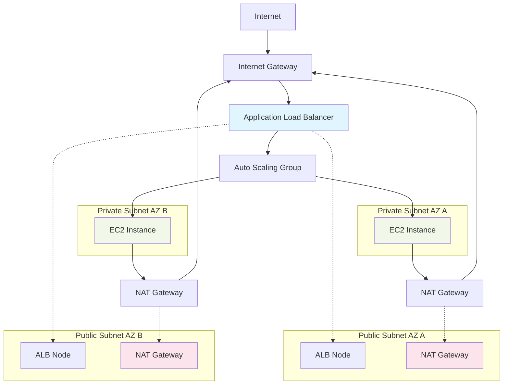

# Staging infrastructure for AWS with Terraform




### Solution Design:

- EC2 in private subnets and traffic allowed through ALB only.

- ALB in public subnets

- Auto Scaling Group, 2AZ for high availability

- NAT Gateway per AZ (costly for staging)

- EC2 connect via SSM

- Security groups allowing only relevant traffic

- Repo code desighned for several environments for future

## Compromises and recommendations for Production environment
- HTTPS implementation
- 3 AZ
- Advanced IAM
- Cloudwatch for monitoring and alerting
- S3 for terraform state
- CI/CD pipeline
- Cost optimizations with spot instances (probably)
- Tests
- Using public Terraform modules for version managing
- Refactor code for different environments

## Steps for reproduce
### Prerequisites
1. AWS Account with appropriate permissions
2. Terraform 1.9.0 isntalled
3. AWS CLI configured
-----
### Clone repository and first go to vpc dir

```
git clone https://github.com/don-novikov/aws_test_infra
cd aws_test_infra/staging/vpc
```

### Create variables file (terraform.tfvars)

```
aws_region          = "eu-central-1"
vpc_cidr            = "10.0.0.0/16"
availability_zones  = ["eu-central-1a", "eu-central-1b"]
public_subnet_cidr  = ["10.0.101.0/24", "10.0.102.0/24"]
private_subnet_cidr = ["10.0.1.0/24", "10.0.2.0/24"]

```

### Apply Terraform

```
terraform init
terraform apply
```

### Go to cloud folder

```
cd ../cloud
```

### Create variables file (terraform.tfvars)

```
aws_region = "eu-central-1"
vpc_id = "<>"
public_subnets  = ["", ""]
private_subnets = ["", ""]
```

### Apply Terraform

```
terraform init
terraform apply
```

### Check if service is working using alb DNS name from output
```
curl http://<output_dns_name>
```